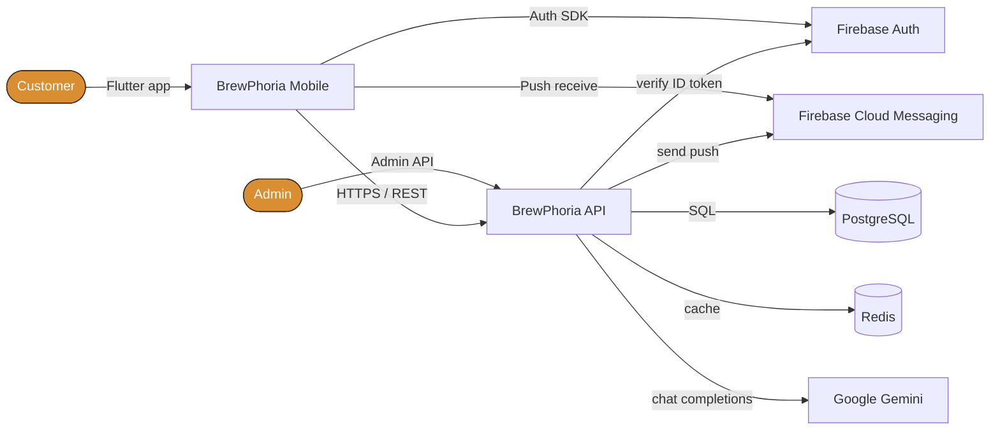
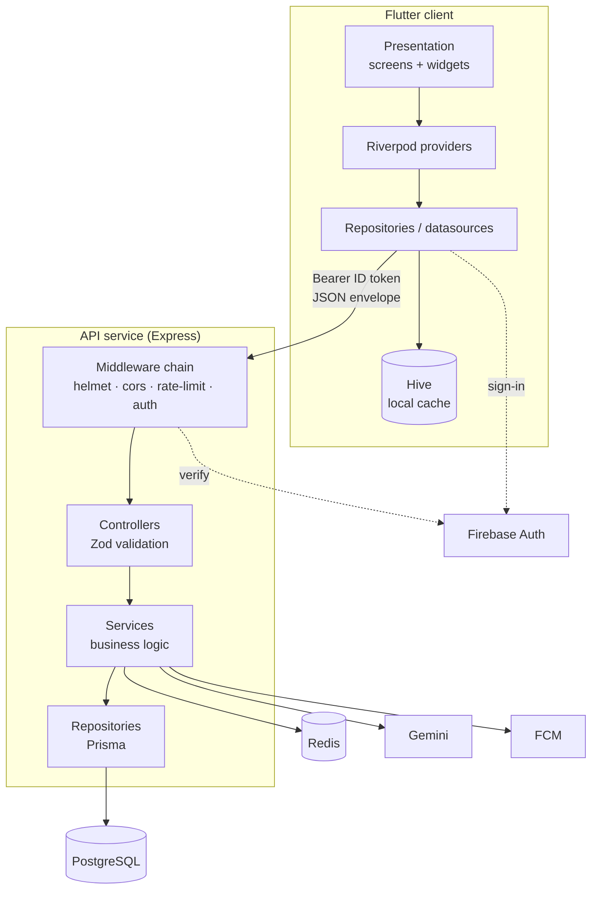
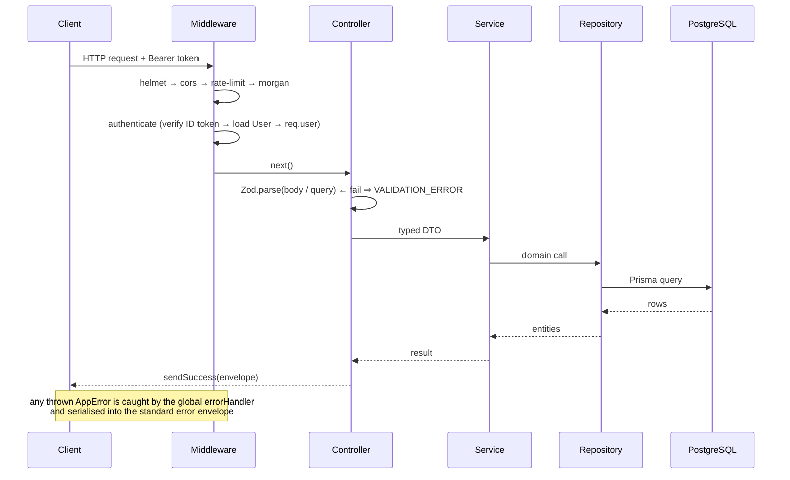
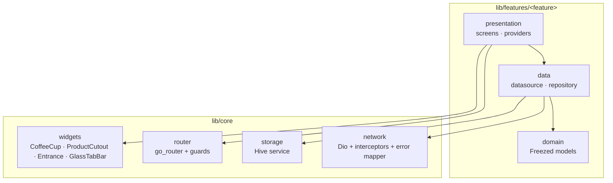
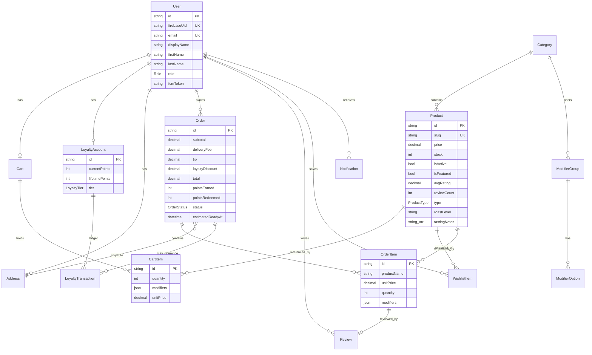
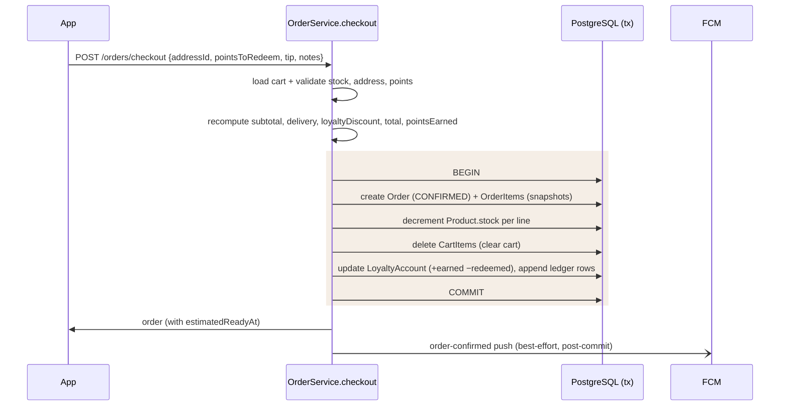
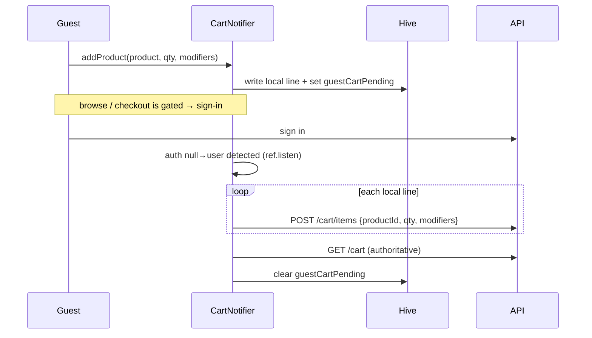

# BrewPhoria — Architecture & Engineering Overview

> A production-grade coffee-ordering platform: a **Flutter** mobile client backed by a
> **TypeScript / Express / PostgreSQL** REST API, with Redis caching, Firebase auth &
> push, and a tool-augmented Gemini "AI Barista". This document explains how the system
> is built, the data flows that matter, and the engineering decisions behind them.

---

## Table of contents

1. [System context](#1-system-context)
2. [Technology stack](#2-technology-stack)
3. [Container architecture](#3-container-architecture)
4. [Backend architecture](#4-backend-architecture)
5. [Mobile architecture](#5-mobile-architecture)
6. [Data model (ERD)](#6-data-model-erd)
7. [Core flows](#7-core-flows)
8. [Cross-cutting concerns](#8-cross-cutting-concerns)
9. [Engineering case studies](#9-engineering-case-studies)
10. [Testing strategy](#10-testing-strategy)
11. [Deployment & operations](#11-deployment--operations)
12. [Known trade-offs & roadmap](#12-known-trade-offs--roadmap)

---

## 1. System context

BrewPhoria lets a customer browse a coffee catalogue, customise drinks, build a cart
(**as a guest or signed-in user**), check out with delivery + tips + loyalty redemption,
track the order live, earn/redeem loyalty points, review purchases, and ask an AI barista
for recommendations. An admin surface manages catalogue, orders, and moderation.



**Design stance.** The client is treated as *untrusted*: every price, discount, loyalty
delta, and stock decrement is (re)computed server-side inside a transaction. The client
optimises for perceived performance (optimistic UI, offline cart, image decode sizing)
but is never the source of financial truth.

---

## 2. Technology stack

| Concern | Mobile | Backend |
| --- | --- | --- |
| Language | Dart 3 (Flutter 3.38) | TypeScript 5 (Node 20) |
| State / structure | Riverpod (code-gen), feature-first | Layered: routes → controllers → services → repositories |
| Data models | Freezed + json_serializable | Prisma 7 (`@prisma/adapter-pg`) |
| Persistence | Hive (local cache/prefs) | PostgreSQL |
| Networking | Dio (typed client + interceptors) | Express 4 |
| Routing | go_router (guarded redirects) | Express Router (per-router middleware) |
| Auth | Firebase Auth SDK | Firebase Admin (ID-token verification) |
| Realtime/push | FCM | FCM (admin send) |
| Caching | in-memory image + provider cache | Redis (`ioredis`) |
| AI | — | Gemini `2.5-flash` (`@google/genai`) |
| Validation | model parsers + guards | Zod at every controller boundary |
| Media | `cached_network_image`, decode sizing | Multer + Sharp → WebP 1200² |
| Testing | `flutter analyze`, widget/unit | Jest + Supertest + `jest-mock-extended` |
| Delivery | — | Docker Compose, Nginx, Cloudflare |

---

## 3. Container architecture



Each layer only talks to the one directly beneath it. Controllers never touch Prisma;
services never parse HTTP; the UI never calls Dio directly. This keeps the blast radius
of any change small and the layers independently testable.

---

## 4. Backend architecture

### 4.1 Request lifecycle



### 4.2 Layer responsibilities

- **Routes** (`src/routes/*`) — wire URLs to controller methods and apply middleware
  (`authenticate`, `requireAdmin`, `chatRateLimiter`). Mounted under `/api/v1`.
- **Controllers** (`src/controllers/*`) — the HTTP boundary. Parse & validate with Zod,
  call one service method, shape the response with `sendSuccess`. No business logic.
- **Services** (`src/services/*`) — all business rules: pricing, stock, loyalty math,
  transaction orchestration, notification dispatch, cache reads/writes.
- **Repositories** (`src/repositories/*`) — the only place Prisma is imported. Encapsulate
  queries and `include`/`select` shapes; return entities.
- **Utilities** — typed `AppError` hierarchy, `sendSuccess/sendError`, pagination helpers,
  loyalty/tier math.

### 4.3 Patterns enforced

| Pattern | Where | Why |
| --- | --- | --- |
| Repository | `repositories/*` | Swappable data layer, mockable in tests |
| Thin controllers | `controllers/*` | HTTP concerns isolated from logic |
| Validation at the edge | Zod in every controller | Nothing untyped reaches a service |
| `asyncHandler` wrapper | all routes | Async rejections routed to one error handler |
| Soft delete | `Product.isActive` | Preserve order history & analytics |
| Immutable snapshots | `OrderItem.{productName,productImage,unitPrice,modifiers}` | Order history is stable even if the catalogue changes |
| Append-only ledger | `LoyaltyTransaction` | Auditable points balance |

---

## 5. Mobile architecture

Feature-first modules keep each domain self-contained; shared primitives live in `core/`.



**Key ideas**

- **Riverpod (code-gen)** for state. Async data is `AsyncValue`; notifiers own mutations
  and do optimistic updates with rollback.
- **Offline-first cart.** Guests operate a local Hive cart; signed-in users hit the API.
  The two are reconciled on sign-in (see [case study 9.1](#91-conflict-free-guestaccount-cart-merge)).
- **Guarded navigation.** `go_router`'s `redirect` gates onboarding, auth, and guest-only
  vs account-only routes from a single decision function.
- **Design system as widgets, not CSS.** The signature `CoffeeCup` fill, floating product
  cutouts, glass surfaces, and staggered entrances are native painters/animations that
  honour reduced-motion.
- **Perceived-performance budget.** Images decode at display size (`memCacheWidth` /
  `ResizeImage`), animated widgets sit behind `RepaintBoundary`, and the catalogue paginates
  10 at a time with infinite scroll.

---

## 6. Data model (ERD)



**Modelling notes**

- **Money is `Decimal(10,2)`** in Postgres — never floating point. Prisma serialises
  `Decimal` to a JSON *string*; the API maps money fields to numbers in DTOs and the client
  parses tolerantly (see [case study 9.2](#92-money-integrity-across-the-wire)).
- **Cart lines are keyed by `id`, not `(cart, product)`** — the same product with different
  modifier selections is a distinct line. `unitPrice` is the base price plus the sum of the
  selected option `priceDelta`s, computed server-side at add time.
- **`OrderItem` snapshots** name/image/price/modifiers so a delivered order never mutates
  when the catalogue changes.
- **Denormalised `avgRating` / `reviewCount`** on `Product` keep list queries O(1); an exact
  histogram is available on demand via the review-summary read model.

---

## 7. Core flows

### 7.1 Authentication handshake

```mermaid
sequenceDiagram
    participant App
    participant FB as Firebase Auth
    participant API
    participant DB

    App->>FB: signIn (email / Google)
    FB-->>App: Firebase ID token (JWT, 1h)
    App->>API: POST /auth/login (Bearer ID token)
    API->>FB: verifyIdToken()
    FB-->>API: decoded claims (uid, email, name)
    API->>DB: upsert User by firebaseUid<br/>(derive firstName/lastName)
    API-->>App: user profile
    Note over App,API: subsequent calls send the same Bearer token;<br/>authenticate middleware verifies it and loads req.user
```

The backend holds no passwords and issues no session cookies — Firebase is the identity
provider; the Postgres `User` row is the domain projection keyed by `firebaseUid`.

### 7.2 Checkout as an atomic transaction



Everything that must be consistent (order creation, stock, cart clear, points) is in **one
Prisma `$transaction`**. Side effects that may fail without corrupting state (push
notifications) run *after* commit.

### 7.3 Guest cart → account merge



The `guestCartPending` flag persists in Hive so the merge survives a cold start after
sign-in, not just the same-session transition.

### 7.4 Loyalty earn & redeem

- **Earn (at checkout):** `pointsEarned = ⌊ subtotal × 10 × tierMultiplier ⌋`
  where multipliers are Bronze 1×, Silver 1.25×, Gold 1.5×, Platinum 2×.
- **Redeem:** `100 points = $1`. The client can earmark a redemption in the cart; the value
  is carried into checkout via a shared provider, re-validated, and applied inside the
  checkout transaction (capped at subtotal and available balance).
- **Tiers (by `lifetimePoints`, monotonic):** Bronze 0, Silver 500, Gold 1500, Platinum 3000.
  A tier-up dispatches a `LOYALTY_TIER_UP` notification.

### 7.5 AI Barista (tool-augmented)

```mermaid
sequenceDiagram
    participant App
    participant Chat as ChatService
    participant DB
    participant Gemini

    App->>Chat: POST /chat/message {message, sessionId?}
    Chat->>DB: load/create session + history
    Chat->>Chat: build system prompt + catalogue slugs
    Chat->>Gemini: history + user turn
    Gemini-->>Chat: reply text with [[product:&lt;slug&gt;]] tags
    Chat->>DB: resolve tags → real products (numeric price)
    Chat->>DB: persist turn
    Chat-->>App: {reply, products[]}  → inline product cards
```

The model is constrained to reference real catalogue items via a slug tag that the service
resolves against the database — so recommendations are always linked to purchasable,
correctly-priced products rather than hallucinated ones.

---

## 8. Cross-cutting concerns

### 8.1 Response envelope

Every response is a consistent envelope — `{ success, data, message, meta? }` on success,
`{ success:false, error:{ code, message, fields? } }` on failure. The client maps typed
`AppException`s to friendly copy; users never see raw `Exception:` strings.

### 8.2 Caching (Redis)

| Key | TTL | Invalidation |
| --- | --- | --- |
| `brewphoria:products:list:<hash>` | 5 min | pattern-purged on any product create/update/delete |
| `brewphoria:products:slug:<slug>` | 5 min | purged on that product's update/delete |
| `brewphoria:dashboard:stats` | 60 s | TTL only |

List keys hash the full query (category, price, sort, search, page) so every filter
combination caches independently and safely.

### 8.3 Security

- Firebase ID-token verification on every authenticated route; `requireAdmin` on `/admin/*`.
- `helmet` security headers; CORS restricted to `ALLOWED_ORIGINS`.
- Tiered rate limits: global 100/15 min, auth 10/15 min, chat 10/15 min.
- Server-authoritative pricing/stock/points; the client cannot set a total.
- Uploads validated by MIME + size and re-encoded through Sharp (strips payloads).
- **Third-party keys stay server-side.** The Google Maps key lives only in the API's
  environment; address autocomplete is a **backend proxy** (`/places/*` over the Places API
  New), so no billable key ships in the app where it could be extracted.

### 8.4 Image pipeline

Admin uploads: Multer (memory) → Sharp resize ≤1200² → WebP q80 → served from `/uploads`.
Client rendering: decode at display size and cache; product cutouts render with a single
decode reused for image + shadow, wrapped in `RepaintBoundary`.

### 8.5 Push notifications & deep-linking

The backend persists every notification and, when the user has an FCM token, sends a push
(`NotificationService`). The client (`push_notifications.dart`) requests permission,
registers its token on sign-in (`PATCH /auth/fcm-token`), shows foreground messages in-app,
and **deep-links on tap** using a `type` marker in the FCM data payload
(`ORDER_STATUS_CHANGED` → order detail, `REVIEW_REQUEST` → write-review). Reaching
`DELIVERED` sends both the status push and a post-order review nudge — the review type lives
only in the data payload, so the `Notification.type` enum needed no migration.

---

## 9. Engineering case studies

> Short write-ups of decisions where the "obvious" approach would have introduced a defect.

### 9.1 Conflict-free guest/account cart merge

**Problem.** Letting guests build a cart is a conversion win, but the cart is server-owned
and priced server-side. A naïve "copy local cart to server on login" breaks in three ways:
the provider can be disposed during the auth transition (losing in-memory state), the login
can complete on a *cold start* (so there's no in-memory cart at all), and a partial network
failure can double-add lines.

**Solution.** The local cart is the source of truth *only while guest*, persisted to Hive
with a `guestCartPending` flag. On any transition into an authenticated state — whether same
session (`ref.listen` on auth) or a cold start (checked in `build()`) — the notifier replays
each local line through the real `POST /cart/items` endpoint (which merges idempotently by
product + option set), then re-reads the authoritative server cart and clears the flag. A
failed replay leaves the flag set so the merge retries next launch. Sign-out clears the
local cache so nothing leaks between accounts. The signed-in path is completely untouched,
so a bug here can never corrupt an authenticated checkout.

### 9.2 Money integrity across the wire

**Problem.** Prisma serialises `Decimal` to a JSON **string**, but newly added money fields
(modifier `priceDelta`, cart `unitPrice`) were being exposed as **numbers**. A client that
assumes one representation silently mis-parses the other — the kind of bug that only shows
up at the till.

**Solution.** Money is `Decimal(10,2)` end to end in the database and in all arithmetic;
the API normalises money to numbers in its DTOs; and the client parses with a tolerant
`numToDouble` that accepts either a number or a numeric string. All cart/checkout totals are
recomputed server-side, so the wire format is a display concern, never a correctness one.

### 9.3 Atomic checkout under concurrency

**Problem.** Checkout must create an order, decrement stock, clear the cart, and move loyalty
points. If any step fails midway you get charged-but-no-stock, or spent points with no order.

**Solution.** All mutations run inside a single Prisma `$transaction`; totals, `pointsEarned`,
and the redemption are recomputed from server state inside that boundary (the client's numbers
are inputs to validate, not values to trust). Best-effort side effects (FCM push to the
customer and admins) are deliberately kept *outside* the transaction so a flaky push can never
roll back a paid order.

### 9.4 Exact review summary without an N+1

**Problem.** The reviews screen shows a 1–5★ distribution. Computing it from the currently
loaded page is wrong (the histogram changes as you scroll); loading *all* reviews to count
them is an unbounded query.

**Solution.** Product list/detail reads use the **denormalised** `avgRating`/`reviewCount`
for O(1) cost. For the exact histogram, a dedicated read model — `GET /products/:id/reviews/summary`
— runs one `aggregate` + one `groupBy` and returns `{ average, count, distribution }`. The
client prefers it and falls back to page-derived counts if it's unavailable.

### 9.5 Award-grade interaction on a performance budget

**Problem.** The product-detail entrance (the card's image arcs to the top while the sheet
rises from the bottom) and the featured-tile parallax are exactly the effects that tank
frame times if implemented carelessly on 1 MP transparent PNGs.

**Solution.** A shared Hero with a `MaterialRectArcTween` drives the arc; the cutout widget
decodes once at a card-appropriate size and reuses that decode for both the image and its
alpha shadow, all behind a `RepaintBoundary`. Parallax reads the scrollable's position via
the standard render-object recipe rather than rebuilding the list. Every motion primitive
checks `MediaQuery.disableAnimations` and degrades to an instant state.

### 9.6 Category isn't the same axis as customizability

**Problem.** Product-detail customization (size, milk, sweetness, add-ons) was originally
gated by the product's **category** — fine until a category itself turns out to hold more
than one kind of thing. "Tea & Alternatives" mixes drinkable items (matcha, chai) with
retail packaged goods (loose-leaf tea, milk alternatives sold by the litre); a category-only
check handed every product in that category the same Size/Milk/Sweetness/Add-ons set,
including a bottle of oat milk.

**Solution.** Customizability is a property of the **product**, not its shelf location, so it
needed its own field: a `ProductType` enum (`DRINK` / `BEANS` / `MERCH`) on `Product`.
`ProductService.getBySlug` now checks `product.type` before returning modifier groups —
`MERCH` short-circuits to an empty array regardless of what's attached to the category.
Detail metadata follows the same split: roast level and tasting notes are "coffee" metadata
(relevant to a bag of beans, not just a drink), while calories/caffeine/prep-time are
drink-specific and `DRINK`-only. The mobile client needed **no new conditionals** — it was
already rendering purely off `modifierGroups`/`roastLevel`/`tastingNotes`, so fixing the data
at the source fixed the UI everywhere it's consumed, with the server staying the single
source of truth for "does this product customize."

---

## 10. Testing strategy

| Level | Tooling | Focus |
| --- | --- | --- |
| Backend unit | Jest + `jest-mock-extended` | services with repositories mocked (loyalty math, checkout rules) |
| Backend integration | Supertest + ephemeral Postgres | route → controller → service → DB happy & error paths |
| Contract | shared response envelope + Zod | every endpoint returns the standard shape |
| Mobile static | `flutter analyze` (CI-gating, zero warnings) | null-safety, lints, dead code |
| Mobile behaviour | widget/unit + a preview harness | screens render from sample data via ProviderScope overrides |

Additive-optional API evolution (modifiers, tip, ETA, sort) kept existing order/checkout
tests green — a deliberate backward-compatibility constraint.

---

## 11. Deployment & operations

- **Containerised** with Docker Compose (API + Postgres + Redis); Nginx terminates TLS with
  Cloudflare in front.
- **Config** is Zod-validated at boot (`src/config/env.ts`) — the process refuses to start
  with a missing/invalid variable rather than failing at first request.
- **Migrations** are Prisma-managed and versioned; schema changes ship as explicit migrations.
- **Observability** via Winston + Morgan structured logs; a `/health` endpoint is excluded
  from rate limiting for probes.
- **Background jobs** (`node-cron`) handle loyalty-point expiry and similar periodic work.

---

## 12. Known trade-offs & roadmap

Documented deliberately — knowing what you *didn't* build is part of the design.

- **Promotions/rewards are partly static.** The loyalty "rewards" are modelled as point-value
  credits that apply through the real redemption path; a first-class `Promotion` model is the
  next step for coupon codes and time-boxed offers.
- **Order tracking is ETA + status push, not a live socket.** `estimatedReadyAt` plus FCM
  status-change pushes cover the common case; a status-history table and a live socket for
  real-time position/preparation are the planned upgrade.
- **Optimistic add-to-cart is client-side for guests only.** The signed-in path awaits the
  server before updating the badge to avoid double-count races; full optimism needs local-line
  reconciliation.
- **Image hosting is local-disk today.** Uploads are resized to WebP but served from the app
  server; a bucket/CDN with responsive URLs is the scaling path for the catalogue.
